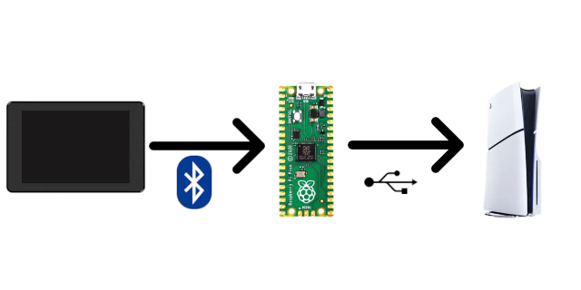

# HD2 Macropad - BT2USB Bridge

This is the software for a Raspberry Pi Pico W to work as a Bluetooth-to-USB bridge for the [HD2 Macropad](https://github.com/unic8s/hd2_macropad).
You connect the Raspberry Pi Pico W via USB cable to your PS5&trade; and it automatically connects the [HD2 Macropad](https://github.com/unic8s/hd2_macropad) via Bluetooth.

> HELLDIVERS and PS5 a registered trademarks of SONY INTERACTIVE ENTERTAINMENT LLC.

## Prerequesites
- Supported microcontrollers
  - [Raspberry Pi Pico W](https://www.raspberrypi.com/documentation/microcontrollers/pico-series.html#raspberry-pi-pico-w-and-pico-wh)
  - [Raspberry Pi Pico 2 W](https://www.raspberrypi.com/documentation/microcontrollers/pico-series.html#pico2w-technical-specification)
- Micro USB data cable to communicate with a PC for flashing the firmware once.

## Installation

The firmware is already pre-built available in our release section. Just go ahead and download your prefered version (we surely recommend to use the lastest one).
Please follow the described steps.

### Firmware
1. Download the [lastest UF2 file](https://github.com/unic8s/bt2usb_bridge/releases/latest) or your prefered [release](https://github.com/unic8s/bt2usb_bridge/releases)
2. Press and hold the BOOT button on the microcontroller while connecting it to PC via Micro USB data cable
3. A file explorer window will open and a (virtual) drive. Copy the downloaded UF2 firwmare file into that drive.
4. After finish copying the file just disconnect the microcontroller from the PC.

## Setup

In general there is no specific further configuration needed.
You just have to connect the microcontroller with a Micro USB cable to the PS5&trade;.

### LED indicator
The onboard LED of the board will show the status of the Bluetooth connection.

- Blinking
  - The microcontroller is scanning for the [HD2 Macropad](https://github.com/unic8s/hd2_macropad)
- Constant
  - The microcontroller successfully found and connected the [HD2 Macropad](https://github.com/unic8s/hd2_macropad)

## Support

We're pleased with your feedback so far and we try to keep up with your good ideas for new features. Thanks to all of you participating on our journey.
If you enjoy the project and want to support our private work feel free to make a small donation.

## Software - for developers

- IDE: [Arduino](https://www.arduino.cc/en/software) + [Pi Pico Core](https://github.com/earlephilhower/arduino-pico)
- Board: [Raspberry Pi Pico W](https://www.raspberrypi.com/documentation/microcontrollers/pico-series.html#raspberry-pi-pico-w-and-pico-wh) or [Raspberry Pi Pico 2 W](https://www.raspberrypi.com/documentation/microcontrollers/pico-series.html#pico2w-technical-specification)
- Framework: Arduino
- Libraries & functions
  - BluetoothHCI for Bluetooth scanning
  - BluetoothHIDMaster for BLE keyboard connection
  - Keyboard for USB HID connection

## Disclaimer and copyright
> This is a private opensource project and is not associated in any kind with SONY INTERACTIVE ENTERTAINMENT LLC.
> SONY INTERACTIVE ENTERTAINMENT LLC is not responsible for any function and content that is related to this project.
> Related assets in this project are either produced by us and free to use or respectively published by the owners mentioned here.
